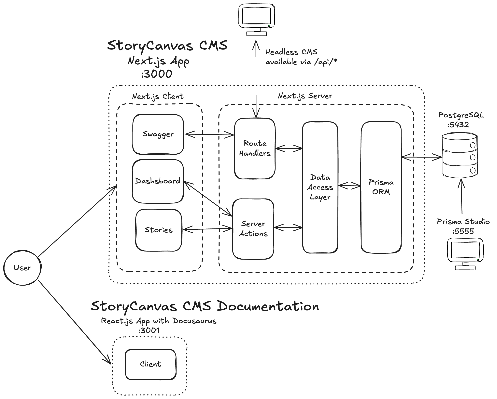

# 🪶 StoryCanvas – Storytelling CMS

**StoryCanvas** is a modular, animation-ready and developer-friendly CMS designed for building structured, rich digital stories. Built with modern technologies like Next.js, Prisma, SWR and GSAP, it supports flexible section types, versioning, media uploads, live previews, and role-based collaboration.

---

## Live Demo

[StoryCanvas deployed in Vercel](https://story-canvas-cms.vercel.app/)
[StoryCanvas Documentation deployed in Vercel](https://story-canvas-cms-docs.vercel.app/)

---

## Tech Stack

- **Framework**: [Next.js (App Router)](https://nextjs.org)
- **ORM**: [Prisma](https://www.prisma.io/)
- **Database**: [PostgreSQL](https://www.postgresql.org/) (via [Docker](https://www.docker.com/) or external)
- **State/Data**: [SWR](https://swr.vercel.app/), [Server Actions](https://nextjs.org/docs/app/building-your-application/data-fetching/server-actions-and-mutations), [Zod](https://zod.dev/) validation
- **Animations**: [GSAP](https://gsap.com)
- **Media**: [Cloudinary](https://cloudinary.com/) integration for image/video uploads
- **Testing**: [Jest](https://jestjs.io/) (unit), [Playwright](https://playwright.dev/) (E2E)
- **Infrastructure**: [Docker](https://www.docker.com/) + [Docker Compose](https://docs.docker.com/compose/)

---

  ## Architecture

  

StoryCanvas is built on Next.js with a clear separation between the headless API and the admin dashboard:

- **Route Handlers** (/api/**) are used for the headless CMS interface, making data accessible to external clients. These endpoints are documented with Swagger and some of them require a session or token for authentication.

- **Server Actions** are used internally within the admin dashboard to mutate data securely. Although are technically public HTTP endpoints, they are not directly accessible without a valid invocation context (e.g., form submission from the dashboard), thanks built-in protections:

  - Encrypted, non-deterministic action IDs

  - Same origin enforcement via the Origin and Host headers

  - POST only method to mitigate CSRF risks

This ensures that internal operations (e.g., creating, updating or deleting content) are only triggered by authenticated users within the dashboard UI.

See [Server Actions adn Mutations - Security](https://nextjs.org/docs/app/building-your-application/data-fetching/server-actions-and-mutations#security) documentation for more info
  ---

  ## API Documentation

  StoryCanvas exposes a headless API.

  > Explore the Swagger API documentation:  
  > [`http://localhost:3000/docs/api-docs`](http://localhost:3000/docs/api-docs)

  ### Available Endpoints

  - `POST /api/auth/token`  
    Get an authentication token (JWT) to access protected routes.

  - `GET /api/stories`  
    Get all stories (requires session or token).

  - `GET /api/stories/draft`  
    Get all draft stories (requires session or token).

  - `GET /api/stories/draft`  
    Get all published stories (public endpoint).

  - `GET /api/stories/{id}`  
    Get a single story by ID (requires session or token).

  - `GET /api/stories/{id}/sections`  
    Get all sections of a story (requires session or token).

  - `GET /api/stories/draft/{id}/sections`  
    Get all draft sections of a story (requires session or token).

  - `GET /api/stories/published/{id}/sections`  
    Get all published sections of a story (public endpoint).

  ---

## Getting Started

### Option A — Docker-based development

#### 1. Clone the repository
```bash
git clone https://github.com/aleixmarsa/story-canvas-cms
cd story-canvas
```

#### 2. Configure .env.docker (Optional)
Add your Cloudinary variables to the `.env.docker` file (copy from `.env.example`) for the full experience.  
> If no Cloudinary variables are provided, image inputs in the section forms will fall back to simple URL inputs.
```env
NEXT_PUBLIC_CLOUDINARY_CLOUD_NAME=...
NEXT_PUBLIC_CLOUDINARY_API_KEY=...
NEXT_PUBLIC_CLOUDINARY_PRESET=...
NEXT_PUBLIC_CLOUDINARY_FOLDER=...
CLOUDINARY_API_SECRET=...
```

#### 3. Start the project with Docker
```bash
docker-compose up
```
- App: http://localhost:3000

- Prisma Studio: http://localhost:5555

- App documentation: http://localhost:3001

> ⚠️ **Note:**  
> The Docker option may take longer to start initially because it runs `next build` and `next start`.  
> This ensures the app runs much faster once it's up, compared to `next dev`, which compiles pages on demand.

### Option B — Local development with `pnpm`

#### 1. Clone the repository
```bash
git clone https://github.com/aleixmarsa/story-canvas-cms
cd story-canvas
```

#### 2. Set up environment variables
Create a .env file by copying the example:
> If no Cloudinary variables are provided, image inputs in the section forms will fall back to simple URL inputs.
```env
DATABASE_URL=...

SESSION_SECRET=...

# Cloudinary account
NEXT_PUBLIC_CLOUDINARY_CLOUD_NAME=...
NEXT_PUBLIC_CLOUDINARY_API_KEY=...
NEXT_PUBLIC_CLOUDINARY_PRESET=...
CLOUDINARY_API_SECRET=...
NEXT_PUBLIC_CLOUDINARY_FOLDER=...
```
> ⚠️ **Note:**  
> If you choose this option, make sure you have a local Postgres instance running.

#### 3. Install dependencies and start the app
```bash
pnpm install
pnpm dev
```
- App: http://localhost:3000

- Prisma Studio: http://localhost:5555

```bash
cd docs
pnpm start
``` 
- App documentation: http://localhost:3001
  
## Testing

### Unit tests
```bash
pnpm test
```

### E2E tests
```bash
pnpm test:e2e
```

## Contributing
We follow a conventional workflow:

- Create a branch per feature or fix:
  - `feature/<short-description>`     → New features
  - `fix/<short-description>`         → Bug fixes
  - `refactor/<short-description>`   → Refactoring code
  - `chore/<short-description>`       → Maintenance tasks (e.g., setup, dependencies)
  - `docs/<short-description>`        → Documentation updates

- Commit your changes (same types as PR):
  - `<type>(scope)`: short description
- Use clear PR titles and descriptions
  - `<type>(scope)`: short description
- Tag after each significant merge. We use semver-style tags
  - `PATCH`: Bug fixes and small changes (e.g., `v0.7.1`)
  - `MINOR`: New features (e.g., `v0.6.0`)
  - `MAJOR`: Breaking changes (e.g., `v1.0.0`)

